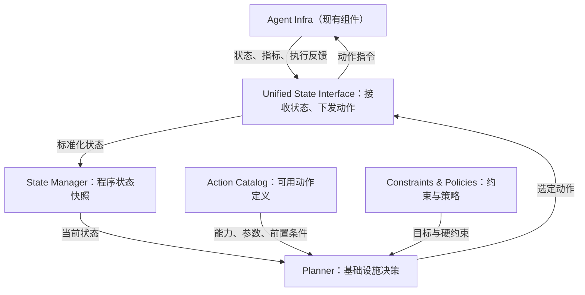

# StateFlow 控制平面简明设计 v1

**定位**：StateFlow 是面向 Agent 工作流的状态与决策控制平面。它关联 Agent、推理、KV、工具和资源状态，选择基础设施动作，并通过统一接口下发给现有组件执行。StateFlow 不替代 Agent 的任务规划，也不接管推理引擎或工具运行时的实际执行。

**当前代码范围**：四个模块分别位于 `stateflow/interface/`、`stateflow/state_manager/`、`stateflow/planner/`、`stateflow/action_catalog/`；`stateflow/control_plane/` 负责装配。当前只有 `route_model` 实际可下发，其他动作是后续扩展方向。以 [架构代码对照](ARCHITECTURE.md) 和 [接入说明](../README.md) 为实现依据。

## 1. 核心架构

| 模块 | 职责边界 |
| --- | --- |
| **Unified State Interface** | 对外只做两件事：接收状态（含执行反馈），下发动作。内部区分 `State Ingestion` 与 `Action Dispatch`；第一版仍为同一服务/接口层。通过组件适配器完成格式转换和指令投递。 |
| **State Manager** | 按 `program_id` 关联各组件事件，维护当前快照、必要历史、数据时效；提供状态查询。组件仍持有其资源的真实运行状态。 |
| **Action Catalog** | 声明支持的动作、参数、目标组件和前置条件，供 Planner 枚举候选；不执行动作。当前是否可执行还需结合 State Manager 中的资源状态判断。 |
| **Planner** | 读取状态、约束、策略和 Action Catalog；过滤不可行动作、选择方案并记录依据。具体策略可以按场景扩展，但同一动作目标由一个决策点仲裁。 |

**执行原则**：Planner 选择动作，Unified State Interface 下发，目标组件负责实际执行和结果反馈。动作反馈作为普通状态事件重新进入 State Manager。对路由等请求关键路径动作，决策与下发必须在请求放行前同步完成；周期性指标可异步采集。逻辑接口统一，不要求所有计算都跨进程往返；推理引擎内部的快速控制策略可通过本地插件实现。

## 2. 最小状态与动作契约

第一版只定义决策所需字段，不建立覆盖所有组件的大而全 Schema。

- **身份与时序**：`program_id`、`turn_id`、`request_id`、事件时间、来源、状态版本；同一 Agent 的多轮请求必须可关联。
- **Agent 状态**：阶段、近期工具结果与失败/重试、程序是否结束。
- **服务状态**：候选模型与实例、队列/负载、可用性；按需加入 KV 命中与占用。
- **动作记录**：`decision_id`、`action_id`、目标、参数、依据、下发时间、执行状态和结果。过期或缺失的状态必须可识别。

动作统一表示为 `Action {decision_id, program_id, action_id, target, params, state_version}`。Catalog 定义参数与前置条件；Dispatch 校验目标和参数、关联回执，并避免同一 `decision_id` 重复下发。决策超时后如何继续由发起请求的组件设定安全默认策略。

## 3. 第一版范围：Coding Agent 请求路由闭环

**接入**：Agent Harness 上报阶段、工具结果、失败和完成事件；Request Scheduler 提供请求决策点与模型/实例动作入口；Inference Engine 上报实例可用性、负载和推理结果。KV、Sandbox、Cluster 在第一版只预留事件与动作扩展位置，不要求同时接入。

**决策时机**：每次 LLM 请求放行前，Scheduler 携带 `program_id` 和本轮上下文发起决策；Planner 读取状态快照，执行以下顺序：

1. 排除不满足模型能力、容量、预算等硬约束的候选。
2. 优先保证任务成功；持续失败或明显恢复阶段触发强模型升级。成功概率证据不足时采用保守规则，不虚构精确预测值。
3. 在满足前两项的候选中，依次比较成本与延迟；返回携带模型与实例的 `route_model` 动作及理由。
4. Unified State Interface 同步下发给 Scheduler；实际路由结果与最终任务结果回流，供后续评估和校准。

**验收**：一条运行轨迹能够完整追溯“输入状态—候选动作—选择理由—下发—执行反馈”；正常进展与连续失败能产生不同模型决策；接口超时或状态过期时请求仍按默认策略运行。用固定强模型及现有调度器作对照，分别报告任务成功率、平均成本、端到端时延与决策开销；第一版不预设性能收益。

## 4. 后续能力的接入边界

| 方向 | StateFlow 所需状态与策略 | 必须由现有组件提供的能力 |
| --- | --- | --- |
| **Switchyard** | 工具历史、阶段/失败信号；逐轮模型路由策略 | Scheduler 的请求前同步路由入口。第一版优先覆盖这一闭环。 |
| **ThunderAgent** | 程序阶段、工具边界、KV 占用、Sandbox 生命周期；程序级调度策略 | Scheduler 在工具边界暂停/恢复和放置；Sandbox 预备/回收。 |
| **Continuum** | 工具耗时分布、KV 驻留、复算/加载成本；TTL 策略 | Inference Engine 内部的 KV 保留、到期释放与优先级控制插件。 |
| **PASTE** | 工具调用序列、参数依赖、预测置信度与资源空闲量；推测资格策略 | Tool Runtime 的预测执行、抢占、真实调用匹配与结果复用接口。 |

这些能力共享程序身份、状态模型与动作定义，但决策触发点不同。特别是 KV TTL 和推测工具执行，不应实现为依赖远程 StateFlow 往返的高频微操作。

## 参考依据

- [NeMo Switchyard · Stage Router](https://nvidia-nemo.github.io/Switchyard/routing_algorithms/stage_router_routing/)
- [ThunderAgent: A Simple, Fast and Program-Aware Agentic Inference System](https://arxiv.org/abs/2602.13692)
- [Continuum / Continnum: Efficient and Robust Multi-Turn LLM Agent Scheduling with KV Cache Time-to-Live](https://arxiv.org/abs/2511.02230)
- [PASTE: Act While Thinking](https://arxiv.org/abs/2603.18897)
